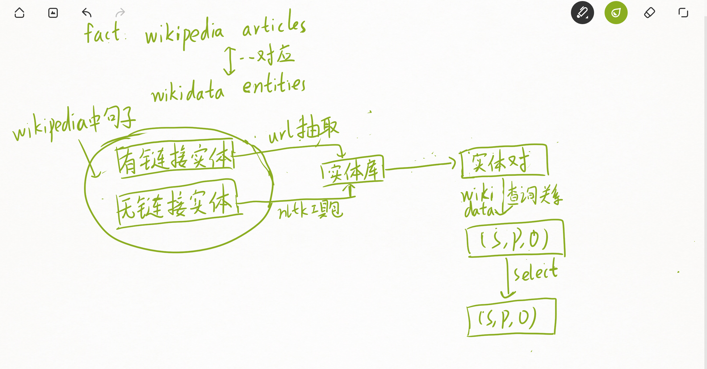

   按照第一周的计划上周我主要看了GCN的两篇paper中的理论和数学推导，理解了GCN的数学原理：GCN是CNN(卷积神经网络)在图这种非欧几里得空间数据结构上的推广。根据卷积的定义(两个函数的卷积等于两个函数频域乘积的逆变换)，人们根据拉普拉斯矩阵的性质构造出了傅里叶(逆)变换在graph上的形式，从而得到了图上的卷积神经网络的形式。
   
   实际上讲，一个信号的时域傅里叶变换的离散化表达就是信号向量和e^jwt向量的乘积加和，天然地满足矩阵形式。而e^jwt是广义的laplacian矩阵的特征向量，因此e^jwt映射到图上就是U(将laplaican做分解)。但是我们都知道算U很复杂，而几个主特征值已经可以较好的刻画U了，因此之后人们做的工作就是：能不能找到好的卷积核，从而使得计算U的复杂度下降(甚至不用算)等等；经过选用恰当的卷积核人们发现了一个虽然不是最优，但数学上看起来很舒服的一个形式：
   
   而巧妙的地方在于L\*x可以和热传导方程连上关系，图上节点信息量的变化不也是受到邻居节点、邻居的邻居...节点的影响嘛。
   
   和CNN一样，GCN也有局部节点的信息提取和参数共享，人们通过改变卷积核的大小来调节卷积核在图上感受野的范围。目前了解到的GCN理论研究重点是设计性质更加好的卷积核，使得计算量更小，更有效提取节点和边信息等。这周的计划是阅读一篇GCN应用到关系抽取的文章，看一看实际应用是怎样的。

---
2020/3/9

#### Graph Convolution over Pruned Dependency Trees Improves Relation Extraction

这周按照计划读了EMNLP 2018的一篇文章，感觉这篇文章的理论方法和写作的构思立意都值得我去思考。
-   从知识的角度想这篇文章把减枝后的句法依存树当作图来做GCN，同时根据实践在kipf提出的GCN形式上输入时加入了一层双向LSTM层(C-GCN)来使得输入具有序列性，这样既可以对图做GCN又能在图的节点处保留来原来句子的序列性信息。从实验上说明了原来的方法(Tree-LSTM)更适合做局部特征关系的提取，而GCN方法对于远距离实体关系抽取有着更好的表现。另外根据关系抽取任务设置了task-specific的减枝策略。 
-   这篇文章的构思挺好，模型并不复杂却有创新，给看的人来说它解决了如何把GCN理论套用到关系抽取这一领域的问题，另外通过充足的实验和图示说明了GCN这种方法和旧的方法比优点在哪；在文章中让人看到了新的理论以及好的实验结果，又能解决原来存在的问题，个人感觉这种写法还是挺适合我学习的。

---
2020/3/16
#### Context-Aware Representations for Knowledge Base Relation Extraction

文章很短，应该是short paper。感觉亮点有两个，首先是他们考虑到一个句子中除了要抽取目标实体间关系之外(下面简称为目标关系)有多个其它关系的情况，这些其它的关系有时候会帮助主要的关系抽取，有时候则会阻碍，因此处理这种跟具体文本有关的模型叫做Context-Aware。这种考虑和实际情况还是挺接近的。

这篇文章是利用多个BI-LSTM分别抽取除了目标关系之外的不同的关系，然后用一个attention layer去判别和学习这些额外的关系对目标关系的影响，如果促进就增加权重当作额外关系，如果是抑制就减小权重相当于过滤噪声。

第二个亮点在于他自己用 wikipedia构建了关系抽取的一个数据集，方法我觉得还是值得借鉴的，拓宽了我的思路，见下图。

另外还看了一篇关于GNN做link prediction和 Entity classification，但是看完了不是很明白，感觉还要多读一下。里面关于GCN是消息传播的一种形式的讨论以及选取合适的参数共享方式防止过拟合的方法我认为还是很值得学习的。
先做个flag以后补
#### Modeling Relational Data with Graph Convolutional Networks